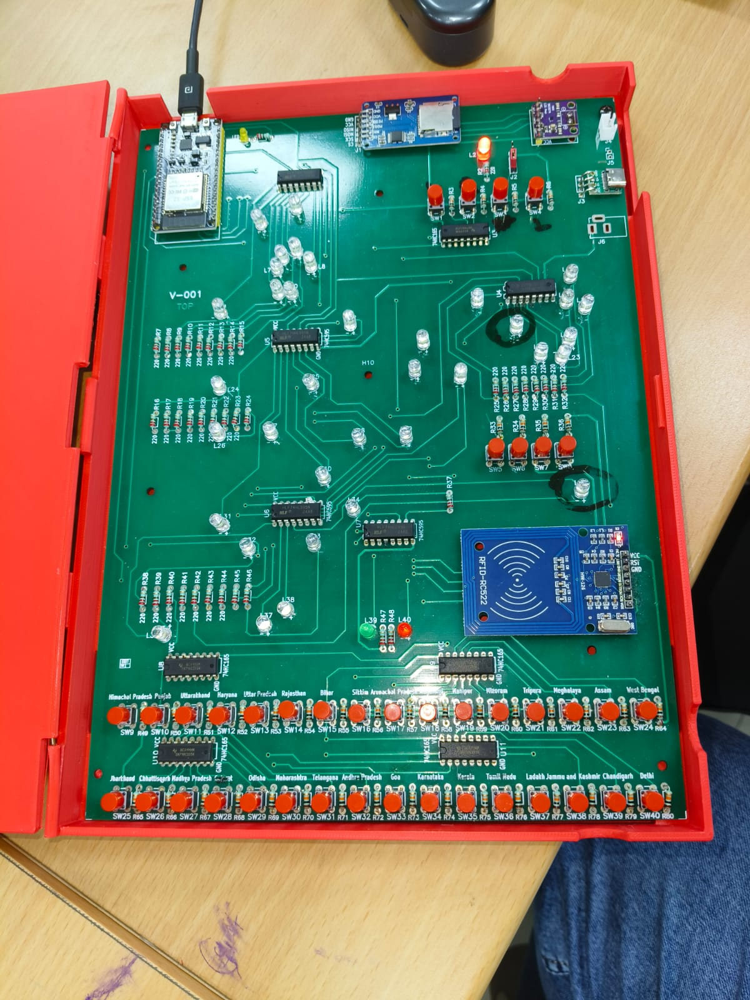

# Social Science Lab Kit



An interactive, talking map of India for the social science classroom. Students
press a button for a state or union territory, or tap its RFID card, and the
board lights up that region on the map and tells them about it out loud. In
quiz mode, the board asks spoken questions and students answer by finding the
right place on the map.

The kit runs on an ESP32. It plays audio in **Hindi and English** through a
Bluetooth speaker and includes grade-specific question banks for **Classes 5,
6 and 7**. The speech was generated with
[Indian Languages TTS](https://github.com/buzzwordExpert/indian_languages_tts),
a companion app built for this kit.

The hardware was developed at Netaji Subhas University of Technology (NSUT),
New Delhi, under the supervision of Prof. Rajveer Yaduvanshi, and is patented.
See [License](#license).

---

## Building Map Skills in Middle School

Map reading is one of the core skills in the middle school social science
curriculum, and one of the hardest to teach from a textbook. A printed map is
static: students can look at it, but it cannot respond, correct them, or check
whether they actually know where a place is. The Social Science Lab Kit turns
the map into something students handle and get feedback from.

**Learning by touch and location.** Each of India's 28 states and 8 union
territories has its own button and LED placed on the map. To answer a
question, a student has to find the region on the map with their own hands.
They have to recall *where* a place is, not just recognise its name in a list
of options.

**Instant feedback.** A correct answer lights the region and a green LED. A
wrong answer lights a red LED, and the board then lights the correct region
and says its name. Students see their mistake on the map right away and learn
the right location at the moment it matters most.

**Matched to the syllabus.** The Class 5, 6 and 7 question banks follow what
students cover in each grade. Teachers can pick the bank for their class,
so questions build on what students are learning in their lessons.

**Learning in the student's own language.** Every prompt, question and
answer is recorded in both Hindi and English, and one button switches between
them. Students who are more comfortable in Hindi aren't held back by the
language of instruction while they learn geography.

**Free exploration and structured practice.** In play mode, students explore
on their own: press any state to hear about it. In quiz mode, the board
keeps score and reads out the result at the end of a session, which makes it
suitable for group activities, revision and quick classroom assessments.

**Many ways to interact.** Buttons suit quick recall drills. RFID cards
add a matching activity: students pick up a card and place it on the reader,
which works well for group play and for students who learn best by handling
objects.

**Designed for classrooms.** The board connects to an ordinary Bluetooth
speaker, so a whole class can hear it. It needs no internet connection
or screen, and all content is stored on a microSD card.

---

## Audio Made with Indian Languages TTS

The kit's spoken content was generated with
**[Indian Languages TTS](https://github.com/buzzwordExpert/indian_languages_tts)**,
a companion desktop app built during the same internship. This includes
region descriptions, quiz questions, prompts and score announcements.

Recording hundreds of clips by hand in two languages would have been slow,
and the voice and volume would have been hard to keep consistent. The app
turns that into a repeatable pipeline:

- Write the content once in English, machine-translate it, and review the
  translations before generating audio.
- Generate speech with Google's gTTS and convert it to 16-bit PCM WAV,
  ready to copy onto the kit's SD card.
- Generate in batches, in parallel, with retries. Only clips whose text has
  changed are regenerated, so a question bank can be updated quickly.
- Export to CSV so native speakers can check the content.

The app supports English, Hindi, Marathi, Bengali, Gujarati and Sanskrit. The
kit currently uses Hindi and English, but the same workflow can produce audio
in other Indian languages.

---

## Features

- 36 buttons and 36 LEDs, one for each state and union territory of India
- Spoken audio for every region in Hindi and English
- **Play mode:** press a button or tap a card to hear about a region
- **Quiz mode:** spoken questions, answer checking, correct/wrong LEDs and
  a spoken final score
- General question bank (87 questions) plus grade-specific banks for
  Class 5 (125 questions), Class 6 (99 questions) and Class 7 (129 questions)
- RFID mode using MIFARE cards labelled with region names
- Audio streamed to any Bluetooth (A2DP) speaker
- One-time Wi-Fi setup page to choose which Bluetooth speaker to pair with

---

## Hardware

| Component | Purpose |
| --- | --- |
| ESP32 DevKit | Main controller, Bluetooth audio, Wi-Fi setup portal |
| 5 × 74HC165 shift registers | Read the 36 region buttons and 4 control buttons |
| 5 × 74HC595 shift registers | Drive the 36 region LEDs |
| MFRC522 RFID reader (RC522) | Reads region cards in RFID mode |
| microSD card module | Stores all audio and the speaker setting |
| Green / red LEDs | Correct / wrong answer indicators |
| Status LED | On while the Bluetooth speaker is connected |
| Bluetooth speaker | Audio output (not on the board) |

### Pin Map

| Function | ESP32 pin(s) |
| --- | --- |
| 74HC165 load (PL) / clock (CP) / data (Q7) | 0 / 18 / 19 |
| 74HC595 latch / clock / data | 16 / 33 / 13 |
| SD card CS / SCK / MISO / MOSI | 21 / 14 / 22 / 23 |
| RFID SS / RST / SCK / MOSI / MISO | 2 / 4 / 5 / 17 / 35 |
| I2S BCLK / LRCK / DOUT | 26 / 25 / 27 |
| Bluetooth LED / correct LED / wrong LED | 15 / 32 / 12 |

---

## Using the Board

### First-time setup

1. Insert the prepared microSD card and power the board.
2. If no speaker has been saved yet, the board starts a Wi-Fi network called
   **`Bharat-Setup`**. Connect to it from a phone or laptop. The setup page
   opens on its own; if it doesn't, go to `http://192.168.4.1`.
3. Enter the **exact** Bluetooth name of your speaker and press
   **Save speaker**. The board saves it to `speaker.txt` on the SD card and
   restarts.
4. Turn on the speaker. When it connects, the status LED lights up and the
   board plays a welcome message.

To switch to a different speaker later, hold **Reset** for 3 seconds. The
board deletes the saved speaker and restarts into the setup page.

### Controls

| Button | Action |
| --- | --- |
| **Region buttons** | Play mode: hear about that region. Quiz mode: answer the current question. |
| **Quiz** (single press) | Start or stop the general quiz. Stopping reads out the score. |
| **Quiz** (double press) | Choose a class quiz: then press **Reset** for Class 5, **Mode** for Class 6 or **Lang** for Class 7. |
| **Reset** (press) | Reset the board to play mode in Hindi and clear the score. |
| **Reset** (hold 3 s) | Forget the saved Bluetooth speaker and restart into setup. |
| **Mode** | Switch between button input and RFID card input. |
| **Lang** | Switch between Hindi and English. |

### RFID cards

In RFID mode, each card identifies a region by text stored in block 4 of a
MIFARE Classic card (default key `FF FF FF FF FF FF`). The text is the
region's name in capitals with no spaces, for example `RAJASTHAN`,
`WESTBENGAL` or `TAMILNADU`. The full list of names is in `cardList` in
[`src/main.cpp`](src/main.cpp).

---

## SD Card Contents

The audio files are not stored in this repository. They go on a FAT32
microSD card with this layout:

```
/
├── Hindi/          Hindi audio: regions, questions, prompts, numbers
├── English/        English audio: regions, questions, prompts, numbers
├── correctword.wav
└── speaker.txt     Created by the setup page
```

All audio is WAV and can be generated with
[Indian Languages TTS](https://github.com/buzzwordExpert/indian_languages_tts).
The exact file names the firmware expects are listed in
[`src/main.cpp`](src/main.cpp). If a question's audio file is missing, the
board skips that question.

---

## Building and Flashing

The firmware is a [PlatformIO](https://platformio.org/) project.

```bash
# Build
pio run

# Flash to the board
pio run --target upload

# Open the serial monitor (115200 baud)
pio device monitor
```

The project uses the `huge_app.csv` partition table so the Bluetooth stack
fits in flash. Dependencies:

- [MFRC522](https://github.com/miguelbalboa/rfid), installed by PlatformIO
- [ESP32-A2DP](https://github.com/pschatzmann/ESP32-A2DP), bundled in
  `lib/ESP32-A2DP`. This is a snapshot of the library's `main` branch taken
  after v1.8.11, with its docs and examples removed.

---

## Project Structure

```
.
├── hardware_images/   Photos of the board
├── lib/
│   └── ESP32-A2DP/    Bluetooth audio library (Apache 2.0)
├── src/
│   └── main.cpp       Firmware
├── platformio.ini     Build configuration
├── LICENSE
└── README.md
```

---

## License

**Proprietary — All Rights Reserved.** Copyright © 2026 Prof. Rajveer
Yaduvanshi, Netaji Subhas University of Technology (NSUT), New Delhi.

The hardware is protected by one or more patents. This code may not be used,
copied, modified, distributed or commercialised. See [LICENSE](LICENSE) for
the full terms.

Third-party components in `lib/` are covered by their own licenses.
